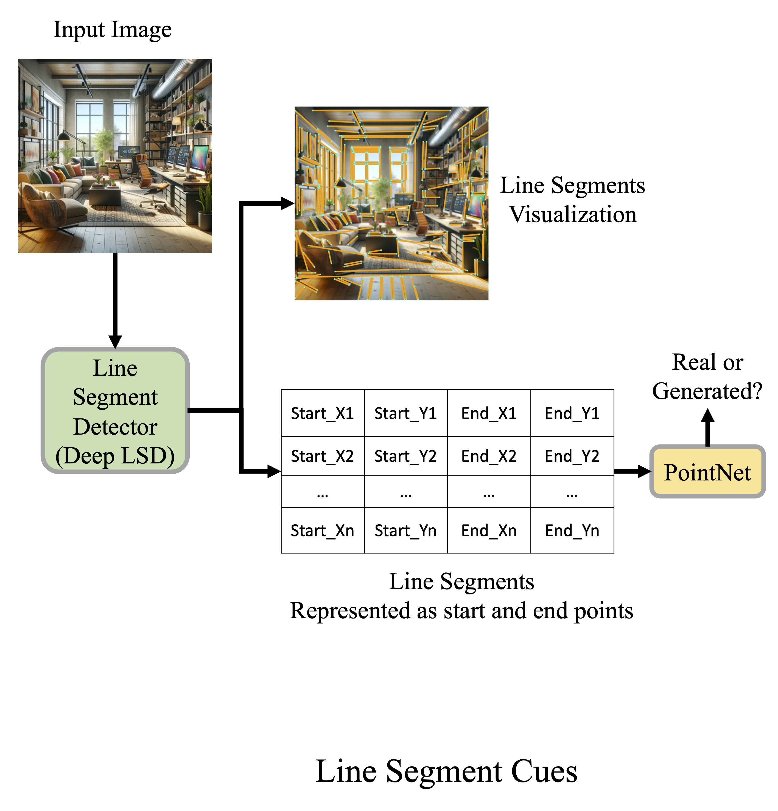

# Line Segment Cues

<p align="center">

</p>

## Getting Started

**The main packages are listed below**
```bash
#Conda
python=3.11.4
torchaudio=2.0.2=py311_cu117
torchvision=0.15.2=py311_cu117
tqdm=4.65.0
pillow=10.2.0
#pip
pandas==2.1.1
scikit-learn==1.3.2
matplotlib==3.8.0
```

Download the Trained Model [here](https://drive.google.com/drive/folders/1y-NThQQGo4_TH2QExjoRwnonG1RQYXGd?usp=share_link) and place them in the `checkpoints` folder

## Dataset Download

The dataset can be found [here](https://drive.google.com/drive/folders/1VWXUlk8O4XEhRBR1-o-mJPjwFfHIU1af?usp=share_link). Download them and place them in the `../dataset` directory.

## Usage

**Training**

Run one of the following:
```bash
python lines_train.py --category indoor
python lines_train.py --category outdoor
python lines_train.py --category combined
```

**Testing**

Run one of the following:
```bash
python lines_test.py --category indoor
python lines_test.py --category outdoor
python lines_test.py --category combined
```

After testing, results will be printed and plots will be generated in the `plots` directory