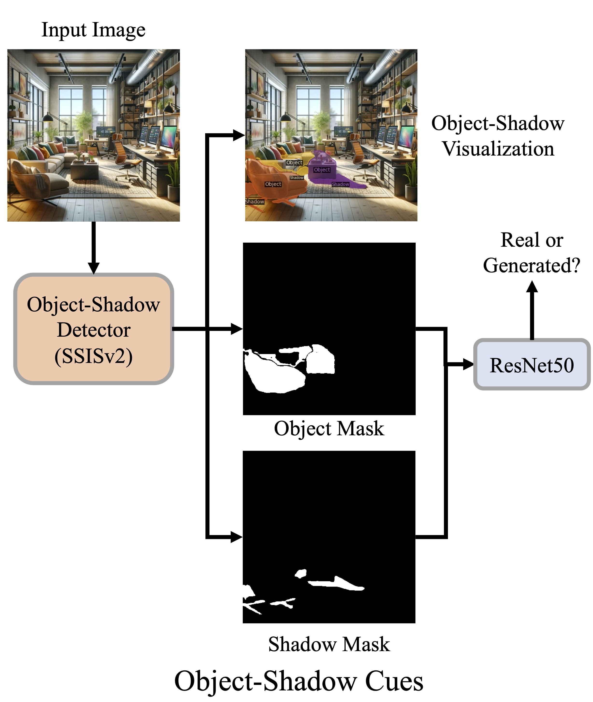

# Object Shadow Cues
<p align="center">

</p>

## Getting Started

**The main packages are listed below**
```bash
#Conda
python=3.11.4
torchaudio=2.0.2=py311_cu117
torchvision=0.15.2=py311_cu117
tqdm=4.65.0
pillow=10.2.0
#pip
pandas==2.1.1
scikit-learn==1.3.2
matplotlib==3.8.0
```

Download the Trained Model [here](https://drive.google.com/drive/folders/1pg6pW1A7n-UGb0HXkm0a8p0HDkc79sDS?usp=sharing) and place them in the `checkpoints` folder

## Dataset Download

The dataset can be found [here](https://huggingface.co/datasets/amitabh3/Projective-Geometry-OS/tree/main)

To get started, download the Kandinsky_Indoor_OS.zip and Kandinsky_Outdoor_OS.zip

```
cd ../dataset
curl -L -o ./Kandinsky_Indoor_OS.zip <link to file>
curl -L -o ./Kandinsky_Outdoor_OS.zip <link to file>
```
where `<link to file>` can be found in the dataset link above and will look something like this: `https://huggingface.co/datasets/amitabh3/Projective-Geometry-OS/resolve/main/Kandinsky_Indoor_OS.zip?download=true`

To unzip the downloaded files:
```
unzip Kandinsky_Indoor_OS.zip
mv Kandinsky_Indoor_OS/* ./
```

**To extracting Shadow and Object masks for new images that are not in the dataset, use [SSISv2](https://github.com/stevewongv/SSIS)**

## Usage

**Training**

Run one of the following:
```bash
python train.py --category indoor
python train.py --category outdoor
python train.py --category combined
```

**Testing**

Run one of the following:
```bash
python test.py --category indoor
python test.py --category outdoor
python test.py --category combined
```

After testing, results will be printed and plots will be generated in the `plots` directory